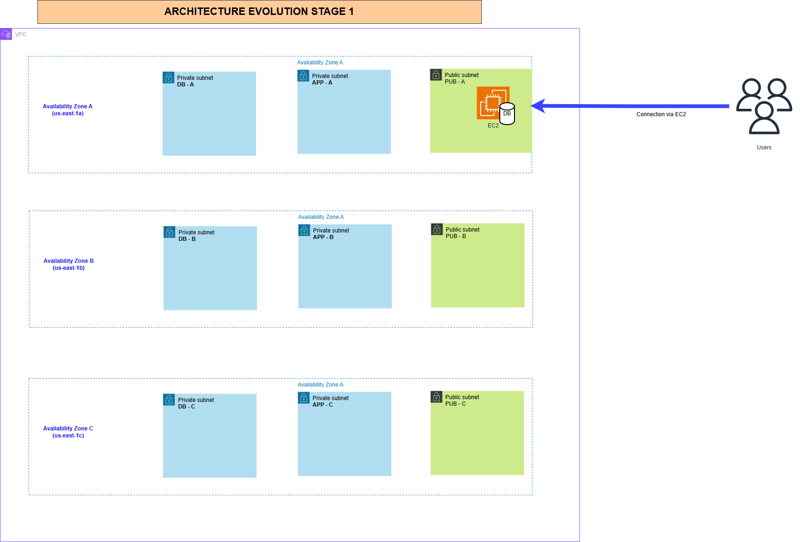
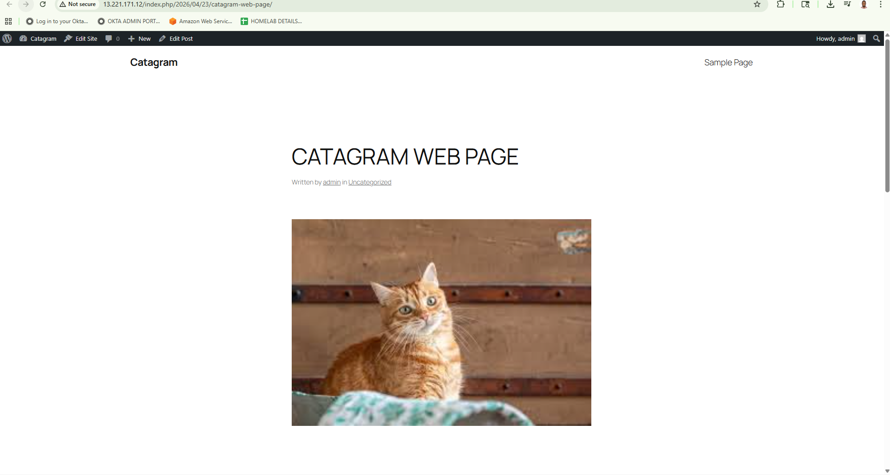

# Stage 1 — Single EC2 Instance

> **Status:** Complete
> **Difficulty:** Beginner–Intermediate
> **Lab time:** ~90 minutes

---

## Video Series for This Stage

| Part | Title | Link |
| ---- | ----- | ---- |
| Part 1 | Project Introduction and Architecture Walkthrough | [Watch on YouTube](https://youtu.be/Ngjx2LWfYFY?si=YH5znZg8kpX9SShD) |
| Part 2 | Architecture Diagram Deep Dive | [Watch on YouTube](https://youtu.be/Kkt6g5VyWKU?si=8_NCv8HnA4Mp6e5i) |
| Part 3 | Deploying the Base Infrastructure with CloudFormation | [Watch on YouTube](https://youtu.be/hPf9r07op5w) |
| Part 4 | Launching the EC2 Instance | [Watch on YouTube](https://youtu.be/Zv2jIfefBjg) |
| Part 5 | Configuring SSM Parameter Store | [Watch on YouTube](https://youtu.be/i3q5NDssjC8) |
| Part 6 | Installing WordPress and Exposing the Limitations | [Watch on YouTube](https://youtu.be/z3AEENtFhBs) |

---

## Objective

Build a fully functional WordPress blog manually on a single EC2 instance. This instance hosts everything — the web server (Apache + PHP), the database (MariaDB), and all media content — in one place.

The goal is not efficiency. It is understanding. By building every component by hand, you experience exactly what WordPress needs to run, and you feel the fragility of this approach first-hand. Every limitation uncovered in this stage is a direct motivation for the architectural changes that follow in Stages 2 through 5.

---

## Architecture

The base VPC is a three-tier design spanning three Availability Zones, provisioned upfront to support the full five-stage architecture. In Stage 1, only the public tier is active. The application and database subnets remain unused until Stages 3 and 4.

A single EC2 instance sits in the public subnet of `us-east-1a`. It runs the web server, the database engine, and stores all WordPress content locally on its root EBS volume. Everything is on one machine, in one Availability Zone, with no redundancy of any kind.

---

## Limitations of This Architecture

| Problem | Consequence |
| ------- | ----------- |
| Single point of failure | One instance crash brings the entire site down |
| No scaling | Cannot handle traffic spikes regardless of demand |
| Data tied to the instance | Terminating the instance destroys the database and all media |
| IP address is not stable | Stopping and starting the instance changes the public IP, breaking WordPress |
| No load balancer or health checks | Customers connect directly to the instance with no abstraction or failover |
| Manual rebuild required | Every recovery means repeating the full installation by hand |
| No Availability Zone redundancy | A single AZ outage takes down everything |

These limitations are demonstrated at the end of Stage 1 and are the exact problems that Stages 2 through 5 address, one at a time.

---

## Prerequisites

- IAM admin user logged in (use the management or general AWS account — not a restricted account)
- Region set to **us-east-1 (Northern Virginia)**
- Base VPC stack deployed via CloudFormation before proceeding (see Step 1 below)

---

## Implementation

### Step 1 — Deploy the Base VPC

1. Go to **AWS Console → CloudFormation → Create stack → With new resources**
2. Choose **Upload a template file** and upload [`cloudformation/A4LVPC.yaml`](../../cloudformation/A4LVPC.yaml)
3. Stack name: `A4LVPC`
4. Scroll to the bottom and check the **IAM capabilities acknowledgement** box
5. Click **Create stack**
6. Wait for the status to reach **CREATE_COMPLETE** before continuing

Once the stack reaches CREATE_COMPLETE, the following 37 resources will exist in your account:

#### Networking

| Resource | Name/Value | Purpose |
| -------- | ---------- | ------- |
| VPC | `A4LVPC` — `10.16.0.0/16` | The main network for the entire project |
| IPv6 CIDR Block | AWS-provided | Adds IPv6 addressing to the VPC |
| Internet Gateway | `A4L-IGW` | Enables internet access for the VPC |
| IGW Attachment | — | Connects the IGW to the VPC |
| Route Table | `A4L-vpc-rt-pub` | Shared routing for all public subnets |
| Route (IPv4) | `0.0.0.0/0` → IGW | Default internet route for IPv4 |
| Route (IPv6) | `::/0` → IGW | Default internet route for IPv6 |
| RT Associations | pub-A, pub-B, pub-C | Links each public subnet to the route table |

#### Subnets — 9 total, three tiers across three Availability Zones

| Subnet | IPv4 CIDR | AZ | Tier | Public IP on launch |
| ------ | --------- | -- | ---- | ------------------- |
| `sn-pub-A` | `10.16.48.0/20` | us-east-1a | Public | Yes |
| `sn-pub-B` | `10.16.112.0/20` | us-east-1b | Public | Yes |
| `sn-pub-C` | `10.16.176.0/20` | us-east-1c | Public | Yes |
| `sn-app-A` | `10.16.32.0/20` | us-east-1a | Application | No |
| `sn-app-B` | `10.16.96.0/20` | us-east-1b | Application | No |
| `sn-app-C` | `10.16.160.0/20` | us-east-1c | Application | No |
| `sn-db-A` | `10.16.16.0/20` | us-east-1a | Database | No |
| `sn-db-B` | `10.16.80.0/20` | us-east-1b | Database | No |
| `sn-db-C` | `10.16.144.0/20` | us-east-1c | Database | No |

Only the public subnets are used in Stage 1. The application and database subnets come into use from Stage 3 onwards.

#### Security Groups — 4

| Name | Allows inbound | First used in |
| ---- | -------------- | ------------- |
| `SGWordpress` | Port 80 (HTTP) from anywhere | Stage 1 |
| `SGDatabase` | Port 3306 (MySQL) from `SGWordpress` only | Stage 3 |
| `SGLoadBalancer` | Port 80 (HTTP) from anywhere | Stage 5 |
| `SGEFS` | Port 2049 (NFS) from `SGWordpress` only | Stage 4 |

All four security groups are created in Stage 1 even though three of them are not used until later stages. This is intentional — `SGDatabase` references `SGWordpress` as its source, and `SGEFS` also references `SGWordpress`. Those references must resolve to a valid security group at creation time. Creating all four upfront avoids circular dependency issues and means the security model is fully defined from the beginning.

#### IAM

| Resource | Purpose |
| -------- | ------- |
| `WordpressRole` | EC2 instance role — grants access to CloudWatch Agent, SSM Parameter Store, and EFS |
| `WordpressInstanceProfile` | Wraps the role so EC2 instances can assume it at launch |

#### SSM Parameter

| Resource | Purpose |
| -------- | ------- |
| `CWAgentConfig` | Stores the CloudWatch agent configuration — defines which logs and metrics to collect from EC2 instances across all stages |

#### Lambda + IAM — IPv6 workaround (4 resources)

CloudFormation cannot natively enable IPv6 auto-assign on public subnets at creation time. To work around this, the template deploys a small Python Lambda function that calls the EC2 `ModifySubnetAttribute` API directly after each public subnet is created. This involves a Lambda function, an IAM execution role, and three custom resource invocations — one per public subnet.

---

### Step 2 — Launch the EC2 Instance

1. Go to **AWS Console → EC2 → Launch Instance**
2. Configure the instance with the following settings and click **Launch Instance**:

| Setting | Value |
| ------- | ----- |
| Name | `WordPress-manual` |
| AMI | Amazon Linux 2023, 64-bit x86 — confirm Free tier eligible |
| Instance type | `t2.micro` (or any free tier eligible equivalent) |
| Key pair | Proceed without a key pair |
| VPC | `A4LVPC` |
| Subnet | `sn-pub-A` |
| Auto-assign public IP | Enable |
| Auto-assign IPv6 IP | Enable |
| Security group | Select existing — `a4l-vpc-sg-wordpress` |
| Storage | 8 GiB gp3 (default — no changes needed) |
| IAM instance profile | `a4l-vpc-WordpressInstanceProfile-...` |
| Credit specification | Unlimited (use Standard if your account is new and Unlimited is not available) |

No SSH key is configured because access to this instance is handled entirely through AWS Systems Manager Session Manager. Session Manager allows secure shell access through the AWS console without opening port 22, without managing key pairs, and with full session logging — a better operational model than traditional SSH for this kind of architecture.

---

### Step 3 — Create SSM Parameter Store Parameters

While the EC2 instance initialises, create the five SSM parameters that WordPress will use at install time. These same parameters are consumed by the automated User Data scripts in Stage 2 and beyond, making this a foundational decision for the entire project. Centralising configuration in Parameter Store means no values are hardcoded anywhere in the application or scripts.

Go to **AWS Console → Systems Manager → Parameter Store**.

> If you have any existing parameters beginning with `/A4L`, delete them before continuing.

Create the following five parameters:

#### /A4L/WordPress/DBUser

| Field | Value |
| ----- | ----- |
| Name | `/A4L/WordPress/DBUser` |
| Description | `WordPress database user` |
| Tier | Standard |
| Type | String |
| Value | `a4lwordpressuser` |

#### /A4L/WordPress/DBName

| Field | Value |
| ----- | ----- |
| Name | `/A4L/WordPress/DBName` |
| Description | `WordPress database name` |
| Tier | Standard |
| Type | String |
| Value | `a4lWordPressDB` |

#### /A4L/WordPress/DBEndpoint

| Field | Value |
| ----- | ----- |
| Name | `/A4L/WordPress/DBEndpoint` |
| Description | `WordPress endpoint name` |
| Tier | Standard |
| Type | String |
| Value | `localhost` |

This is set to `localhost` in Stage 1 because the database runs on the same EC2 instance as the application. In Stage 3, when the database is migrated to Amazon RDS, only this parameter value needs to change — the application code and scripts remain unchanged. This is the value of centralised configuration.

#### /A4L/WordPress/DBPassword

| Field | Value |
| ----- | ----- |
| Name | `/A4L/WordPress/DBPassword` |
| Description | `WordPress DB password` |
| Tier | Standard |
| Type | SecureString |
| KMS key ID | `alias/aws/ssm` |
| Value | Use the strong password provided in the course instructions |

#### /A4L/WordPress/DBRootPassword

| Field | Value |
| ----- | ----- |
| Name | `/A4L/WordPress/DBRootPassword` |
| Description | `WordPress DB root password` |
| Tier | Standard |
| Type | SecureString |
| KMS key ID | `alias/aws/ssm` |
| Value | Use the same strong password as above for this demo |

Both passwords are stored as SecureString, encrypted at rest using the default AWS-managed KMS key for SSM (`alias/aws/ssm`). The EC2 instance role grants permission to read these values at runtime, so no credentials are ever stored in scripts or configuration files.

Once all five parameters are created, confirm they appear in the Parameter Store list under `/A4L/WordPress/`.

---

### Step 4 — Install WordPress via Session Manager

With the EC2 instance running and parameters in place, connect to the instance and perform the full WordPress installation.

**Connect to the instance:**

Navigate to **EC2 → Instances → select WordPress-manual → Connect → Session Manager**. Once the session opens, elevate to root to run all installation commands without repeated `sudo` prefixes.

**Set environment variables from Parameter Store:**

Rather than typing credentials manually, the installation pulls all values directly from Parameter Store using the AWS CLI. This is the same pattern used by the automated scripts in later stages — it means the installation is driven by the same single source of truth that Stage 2 will automate.

**Installation sequence:**

The following steps are performed in order:

1. Update all OS packages to their latest versions
2. Install prerequisites: MariaDB server, Apache web server, wget, PHP and all required PHP modules, and a stress-testing utility used later to trigger autoscaling events in Stage 5
3. Start Apache and MariaDB, and configure both to launch automatically on instance boot
4. Set the MariaDB root password using the value pulled from Parameter Store
5. Download the latest WordPress release, extract it to the Apache web root, and clean up the temporary download files
6. Replace the placeholder values in `wp-config.php` with the actual database name, username, password, and endpoint — all sourced from Parameter Store
7. Correct directory ownership and permissions across the WordPress file structure so Apache can read and write all required paths
8. Create the WordPress database, create the application database user, set the password, and grant the user full access to the WordPress database — all via a SQL script driven by the Parameter Store values

At the end of this process, WordPress is fully installed and the web server is serving the application on port 80.

---

### Step 5 — Verify WordPress and Expose the Limitations

**Access WordPress in the browser:**

Navigate to the EC2 instance's public IPv4 address in a browser. The WordPress setup wizard loads. Complete the installation with a site title, admin username, and password.

**Confirm the application is working:**

Publish a test post with image uploads to confirm that both the database (storing post metadata) and the local file system (storing uploaded media in `wp-content/uploads/`) are functioning correctly.

**Demonstrate the IP address limitation:**

Stop the EC2 instance and start it again. Note that the public IPv4 address has changed. Attempt to access WordPress using the new IP address — the application will fail to load correctly.

This happens because WordPress records the URL it was installed on (including the IP address) directly into the database during setup. When the IP changes, WordPress attempts to redirect requests to the original address, which no longer resolves to this instance. Any new instance, IP change, or instance replacement breaks the application immediately.

This single demonstration illustrates why a load balancer with a stable DNS name is essential — and why the architecture cannot scale without it.

---

## Screenshot

WordPress running live after full manual installation, accessed via the EC2 instance's public IPv4 address:

---

## Key Learnings

### Build manually before automating

It is tempting to skip straight to infrastructure-as-code and automated deployments. However, if you have never built a component by hand, you do not truly understand what you are automating. Stage 1 forces you to install every dependency, set every permission, and configure every connection manually. When Stage 2 introduces a User Data script that does all of this in seconds, the value of automation is immediately obvious — and so is the risk of getting something wrong in the script, because you know exactly what each line is doing.

### Parameter Store as a centralised configuration layer

Hardcoding database credentials or endpoints into application configuration files is a common anti-pattern. If the values change — and in this project they will, multiple times — every file that contains them must be updated. By storing all configuration in SSM Parameter Store from Stage 1, a single source of truth exists for the entire project. The database endpoint changes from `localhost` to an RDS endpoint in Stage 3 by updating one parameter. The application, the scripts, and the launch template all read the same value without modification.

### Why Session Manager instead of SSH

Traditional SSH access requires an open inbound port (port 22), a key pair that must be stored securely, and network-level access to the instance. Session Manager eliminates all three requirements. Access is controlled entirely through IAM — the instance role and the user's IAM permissions determine who can connect. Sessions are logged to CloudWatch and S3. No key pair management is needed. This is the access model used in production environments and it is the right pattern to learn from the beginning.

### The IP hardcoding problem in WordPress

WordPress stores the site URL in the database at installation time. This URL is used for all internal redirects, asset loading, and link generation. If the instance is stopped and restarted, the public IP address changes and the stored URL becomes invalid — the site breaks. This is not a WordPress bug. It is a consequence of building a stateful application on infrastructure with no stable addressing. The fix is not to patch WordPress — it is to put a load balancer in front of the instances so that customer traffic always connects to a stable DNS name, regardless of which instance or IP is behind it. Stage 5 solves this permanently.

### Stateful versus stateless architecture

Stage 1 is fully stateful. The EC2 instance holds three things that make it irreplaceable: the running application process, the database containing all post data and user accounts, and the `wp-content/` directory containing all uploaded media. If the instance is terminated, all three are lost. There is no way to replace the instance without starting over. A stateless architecture — which this project reaches at the end of Stage 4 — means the compute layer holds none of those things. The database lives in RDS, the media lives in EFS, and any instance can be terminated and replaced without data loss. Reaching that state requires removing one dependency at a time, which is exactly what Stages 2 through 4 do.

### Forward planning in security group design

The CloudFormation template creates all four security groups in Stage 1, even though three of them are not used until later stages. This is deliberate. `SGDatabase` is configured to allow inbound MySQL traffic only from `SGWordpress` — but that reference must point to a real security group at creation time. If `SGDatabase` were created later, `SGWordpress` would need to already exist. Creating all four upfront, with their dependencies resolved, avoids the need to modify security groups mid-project and establishes the complete security boundary for the architecture from the very beginning.

---

## Next Stage

[Stage 2 — Launch Template](../stage-02-launch-template/README.md)
